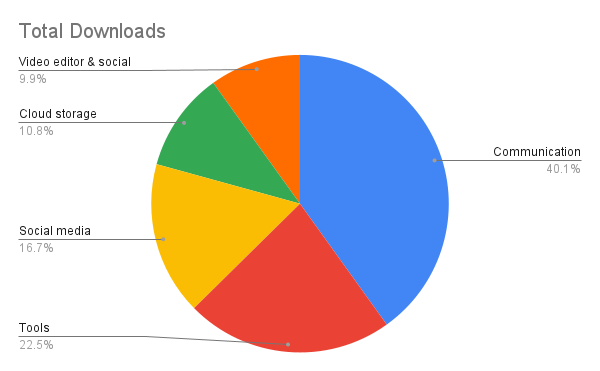
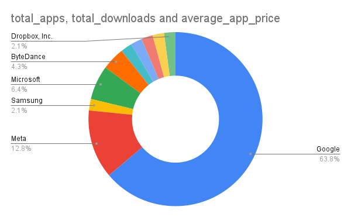

# Play Store Apps Analysis 📱📊

## Project Overview
This project focuses on cleaning and analyzing a dataset of the most downloaded Google Play Store apps. The goal was to take raw, messy string data and transform it into a structured MySQL database for deep analytical insights.

## Data Cleaning Challenges (The "Hard" Part)
The raw data contained several inconsistencies that prevented mathematical analysis. I solved these using SQL:
* **Download Normalization:** Converted strings like `50M+`, `1B`, and `500,000+` into `BIGINT` (e.g., `1,000,000,000`) using `REPLACE` and `SUBSTRING_INDEX`.
* **Currency Formatting:** Stripped `$` symbols and handled null/empty values to cast the `price` column as a `DECIMAL` type.
* **Data Integrity:** Used `ALTER TABLE` to modify column types once the data was sanitized, ensuring the database is optimized for performance.

## 🛠️ Tech Stack & Data
* **Database:** MySQL (Data Cleaning & Analysis)
* **Visualization:** Google Sheets
* **SQL Script:** [View SQL Script here](scripts/cleaning_and_analysis.sql) 📂
* **Dataset:** [Raw Play Store Data](data/playstore_apps_raw.csv) 📊

## Key SQL Snippets
One of the most complex parts was handling the varying suffixes in the downloads column:
```sql
UPDATE apps_data
SET downloads = REPLACE(downloads, 'M', '') * 1000000
WHERE downloads LIKE '%M';
```

## Data Visualizations

### Top 5 Most Downloaded App Categories


### 💰 Revenue Model: Market Dominance
I compared the total downloads for **Free** vs. **Paid** apps. While I attempted to visualize this in a bar chart, the dominance of Free apps is so extreme (99.96%) that the Paid apps effectively disappear on a standard scale.

| App Type | Total Downloads | Market Share (Downloads) |
| :--- | :--- | :--- |
| **Free** | 249,500,000,000 | **99.96%** |
| **Paid** | 89,000,000 | **0.04%** |

**💡 Key Insight:** Free apps account for almost all user activity. This proves the Google Play Store is almost entirely a "Freemium" or Ad-Supported economy. For developers, charging an upfront price is a massive barrier to user acquisition compared to free alternatives.

### 🍩 Market Share: App Count per Category


**Insight:** This chart shows the distribution of apps across the Top 10 categories. While some categories dominate downloads, others show higher competition in terms of total app volume.
